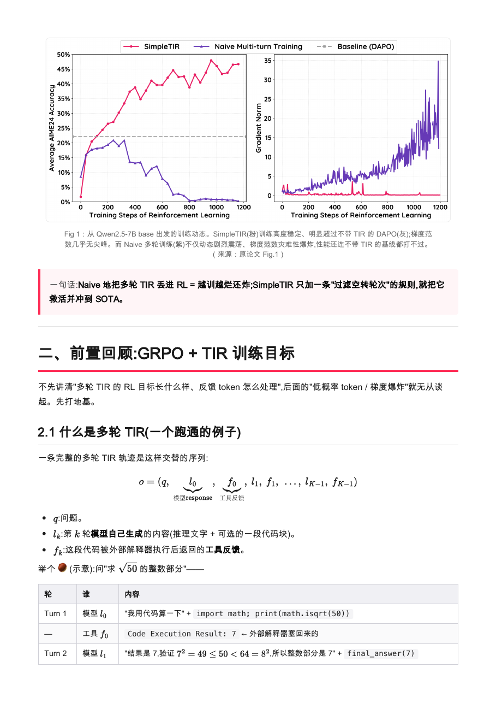

<p align="center">
  
</p>

<h1 align="center">🦥 slothreport-skill</h1>

<p align="center">
  <em>慢工出细活 —— 把一篇论文／算法，解读成<strong>教学式、图文公式表格齐全</strong>的中文 report，并一键导出 PDF。</em><br>
  <sub>A Claude Agent Skill that turns a paper/algorithm into a <strong>teaching-style deep-dive</strong> with formulas, original figures, tables — and one-command PDF export.</sub>
</p>



## 🦥 它和普通"论文总结"有什么不同

普通 summarizer 给你平铺直叙的摘要；slothreport 追求**让没读过原文的人真的看懂**。它把一份好解读的"教学法"固化成了可复用的器件：

- **前置先行** — 先把 baseline / 灵感来源讲透（如先讲 GRPO 再讲 DAPO），再讲主角。
- **逐改动 diff 表** — 每个改动配 `维度 │ baseline │ new │ 为什么` 对比表。
- **公式逐符号拆** — 写出公式后像"从右往左捋求和符号"那样逐项解释，不甩公式不解释。
- **先直觉后数学** — 每个新概念先给直觉（两个极端 → 后果 → 解法），再上式子。
- **具体数字 + 生活类比** — 用真实数字跑场景、用日常类比降低门槛。
- **图文并茂、不丢原图** — 论文的架构图/结果曲线/示意图**抠原始图件保留**（arxiv 源码包 / MinerU），不是糊截图，也不静默丢弃。
- **实验讲透** — Setup / 主结果 / 消融 / 训练动态单独成章，每张结果图都回答"它证明了什么"。
- **忠实溯源** — 公式与数字均取自论文 LaTeX 源，自己的推断显式标注。

## 安装

```bash
# 方式一：作为 Claude skill 安装（推荐）
npx skills add alexcui8591-beep/slothreport-skill   # 或手动 cp 到 ~/.claude/skills/slothreport

# 首次使用前装一次前置（幂等，装过自动跳过）
bash ~/.claude/skills/slothreport/scripts/setup.sh
```

`setup.sh` 会装 `poppler`（抠图）、`python-markdown`（md→html），可选 `matplotlib/numpy/pandas`、`arxiv-latex-mcp`，并检测出 PDF 需要的浏览器 + CJK 字体。**只出 markdown 的话零依赖。**

## 用法

在 Claude Code 里直接说：

```
用 slothreport 解读 https://arxiv.org/abs/2509.02479
```

skill 会：取论文源（arxiv 源码包，含原始图件）→ 定"主角 + 前置"→ 按蓝图搭骨架 → 套教学器件逐节写 → 抠原图 + 渲染公式 → 出稿 → 过质检门。

出 PDF：

```bash
python3 ~/.claude/skills/slothreport/scripts/md2pdf.py "你的报告.md"   # 同名 PDF 落在旁边
```

## 🦥 一键出 PDF：内置了三个"否则每次都要重踩"的坑

`scripts/md2pdf.py`（md → HTML+MathJax → 无头 Chrome）焊死了三个易错点：

1. **数学保护** — 渲染前把 `$...$`/`$$...$$` 抠出占位，避免 markdown 把公式里的 `_`、`*` 当强调符破坏，渲染后再还原交给 MathJax。
2. **图片 base64 内嵌** — 把 `` 转成 data URI 内联，根治"相对路径 + 中文目录名导致图加载不出来"。
3. **CJK 字体注入** — 无头 Chrome 读不到系统字体会把中英文**全渲成空白**；脚本用 `@font-face` 显式喂一个**单文件** CJK 字体（自动探测，mac 上是 Arial Unicode；`.ttc` 集合会加载失败，故只挑单文件），并用经典 `--headless` 规避 `--headless=new` 在 mac 上丢字体。

无需 TeX Live。

## 目录结构

```
slothreport-skill/
├── SKILL.md                      # 触发条件 + 工作流 + 风格硬约束 + 工具栈
├── references/
│   ├── report_blueprint.md       # 章节骨架蓝图
│   ├── style_devices.md          # 7 个教学器件（每个带范本实例）
│   ├── experiments_section.md    # 实验六块 + 硬规矩
│   ├── visuals_and_tools.md      # 图片三分类 + 抠原图 + PDF 流水线
│   └── quality_gate.md           # 交稿前 ABCD 自检
├── scripts/
│   ├── setup.sh                  # 一键装前置（幂等）
│   ├── find_cjk_font.sh          # 自动找单文件 CJK 字体
│   └── md2pdf.py                 # md → PDF（三个坑内置）
└── examples/SimpleTIR/           # 示例：SimpleTIR(arXiv 2509.02479) 的解读
```

## 示例

[examples/SimpleTIR](examples/SimpleTIR) 是用本 skill 对 *SimpleTIR*（arXiv:2509.02479）生成的完整解读（含 .md 与 .pdf）。图片版权见该目录的 [NOTICE.md](examples/SimpleTIR/NOTICE.md)。

## License

[MIT](LICENSE)。示例报告中的论文图件版权归原作者所有，仅作解读示意，见 examples 下的 NOTICE。

<p align="center"><sub>🦥 慢，但每一处都讲透。</sub></p>
