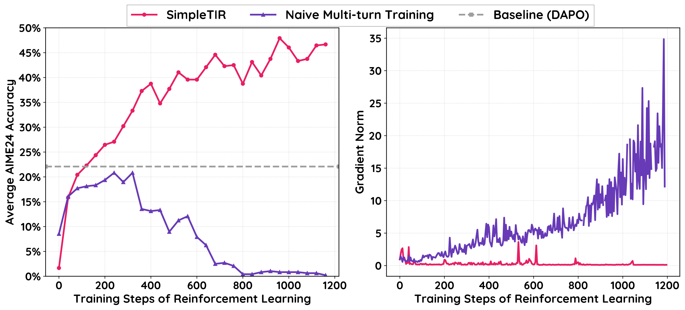
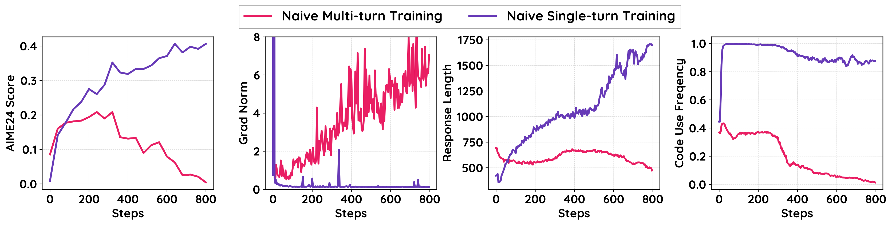
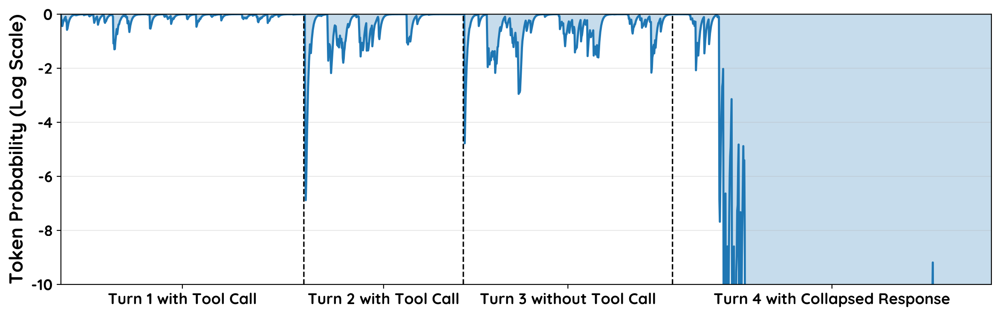
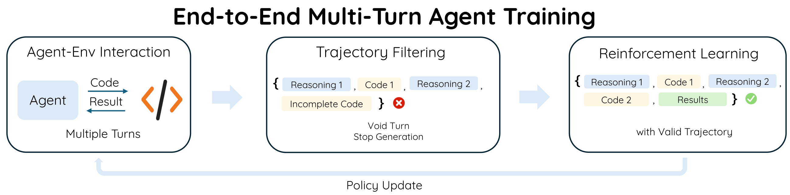
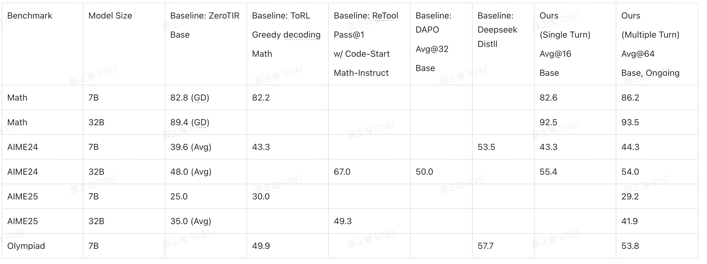
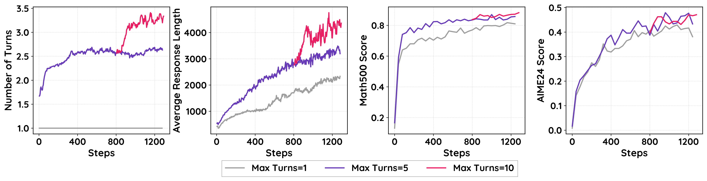
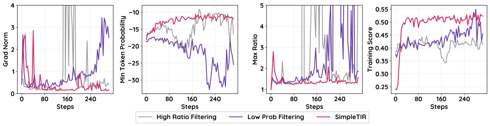
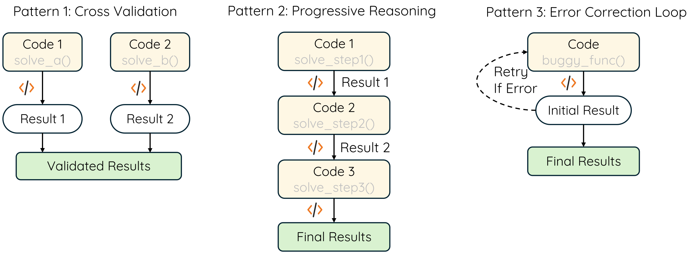

# LLM - SimpleTIR：用"过滤空转轮次"稳住多轮工具推理的强化学习

> 论文：*SimpleTIR: End-to-End Reinforcement Learning for Multi-Turn Tool-Integrated Reasoning*（TikTok / NTU，2025-09-02）
> arXiv: https://arxiv.org/abs/2509.02479 ｜ Code: https://github.com/ltzheng/SimpleTIR ｜ 基座：Qwen2.5-7B / 32B base

---

# 一、简介

让大模型边推理边**调工具**（写代码→执行→拿结果→接着推理），叫 **TIR（Tool-Integrated Reasoning，工具集成推理）**。它能补上 LLM 的两个硬伤：算术不准、知识过时——一个 Python 解释器就能精确算数、跑验证。把 TIR 做成**多轮（multi-turn）**、再用 **RL** 端到端训练，是很诱人的方向。

但有个老大难问题:**多轮 TIR 的 RL 训练极不稳定——会性能崩溃 + 梯度爆炸。** 业界常用的绕法是先用 SFT "冷启动"（cold-start）把模型稳住，但这会把模型锁死在 SFT 数据的固定套路里,丢掉 Zero RL（直接从 base 模型强化学习、不做 SFT）最宝贵的东西:**自发涌现的多样推理行为**。

SimpleTIR 的贡献是把"为什么不稳"诊断清楚,并给出一个**即插即用**的极简解法:

- **诊断**:不稳的根因是**低概率 token 的涌现**——工具反馈是外部解释器产生的,对模型来说是分布外(OOD)输入,会把后续生成带偏、采到极低概率的 token,并**逐轮滚雪球**,最终引发梯度范数的灾难性爆炸。
- **理论**:对 logits 求梯度范数,分离出**两个与 token 概率负相关**的主导项,解释了梯度为何爆炸。
- **方法 SimpleTIR**:过滤掉含 **void turn(空转轮次)** 的整条轨迹——所谓空转,就是某一轮**既没产出完整代码块、也没给出最终答案**。把这种轨迹从策略更新里剔除,就同时堵死了有害的大梯度、又修正了信用分配错位。
- **效果**:Qwen2.5-7B base 上,AIME24 从纯文本基线 **22.1 → 50.5**,在 Zero RL(含/不含 TIR)里全面 SOTA;且因为没走 SFT,模型自发学会**自我纠错、交叉验证**等高级推理模式。

> 一句话:**Naive 地把多轮 TIR 丢进 RL = 越训越烂还炸;SimpleTIR 只加一条"过滤空转轮次"的规则,就把它救活并冲到 SOTA。**

---

# 二、前置回顾:GRPO + TIR 训练目标

不先讲清"多轮 TIR 的 RL 目标长什么样、反馈 token 怎么处理",后面的"低概率 token / 梯度爆炸"就无从谈起。先打地基。

## 2.1 什么是多轮 TIR(一个跑通的例子)

一条完整的多轮 TIR 轨迹是这样交替的序列:

$$o = (q,\ \underbrace{l_0}_{\text{模型response}},\ \underbrace{f_0}_{\text{工具反馈}},\ l_1,\ f_1,\ \dots,\ l_{K-1},\ f_{K-1})$$

- $q$:问题。
- $l_k$:第 $k$ 轮**模型自己生成**的内容(推理文字 + 可选的一段代码块)。
- $f_k$:这段代码被外部解释器执行后返回的**工具反馈**。

举个 🌰(示意):问"求 $\sqrt{50}$ 的整数部分"——

| 轮 | 谁 | 内容 |
|---|---|---|
| Turn 1 | 模型 $l_0$ | "我用代码算一下" + `import math; print(math.isqrt(50))` |
| — | 工具 $f_0$ | `Code Execution Result: 7` ← 外部解释器塞回来的 |
| Turn 2 | 模型 $l_1$ | "结果是 7,验证 $7^2=49\le50<64=8^2$,所以整数部分是 7" + `final_answer(7)` |

关键就在 $f_0$ 这一步:**它是外部解释器产生的、拼回到下一轮输入里的文本**,不是模型自己写的。记住这点,第三章的祸根就埋在这里。

## 2.2 两级 MDP:turn 层 vs token 层

SimpleTIR 把这个过程建模成**分层 MDP(Hierarchical MDP)**,拆成两层:

- **高层 MDP(turn 级)**:状态 $S_k=(q,l_0,f_0,\dots,l_{k-1},f_{k-1})$ 是当前轮之前的全部对话历史;动作 $L_k$ 是"生成一整轮 response $l_k$";奖励 $R_H=R(o)$ 是**只在终局给一次**的稀疏奖励(答对没)。
- **低层 MDP(token 级)**:状态 $s_t$ 是本轮已生成的 token 前缀;动作 $a_t$ 是从词表里选下一个 token;低层**没有中间奖励**($R_L=0$),它只负责把高层选定的"这一轮"写完。

最后训练的是**一个统一策略** $\pi_\theta(a_t\mid s_t)$,同时隐式解这两层。直觉:高层决定"这一轮想干嘛",低层逐 token 把它写出来。

## 2.3 GRPO 目标 + 反馈掩码(公式逐符号拆)

策略用 **GRPO** 优化。GRPO 不需要单独训一个价值网络,而是对同一个 prompt 采样 $G$ 条轨迹,用**组内相对表现**算优势:

$$\hat{A}_i = \frac{r_i - \mathrm{mean}(\{r_j\}_{j=1}^G)}{F_{\text{norm}}(\{r_j\}_{j=1}^G)}$$

- $r_i$:第 $i$ 条轨迹的终局奖励。
- 分子 $r_i-\text{mean}(\cdot)$:**比组内平均好就为正、差就为负**——优于平均的鼓励,劣于平均的压制。
- 分母 $F_{\text{norm}}$:组内归一化(如标准差),把优势缩放到合理量级。

TIR 这里有个**关键改装**:策略只该为自己写的 $l_k$ 负责,**不该为外部塞进来的反馈 $f_k$ 负责**。于是引入**反馈掩码(feedback masking)** $m_{i,t}$:token 属于某个 response $l_k$ 时 $m=1$,属于工具反馈时 $m=0$。最终目标:

$$\mathcal{J}_{\text{TIR}}(\theta)=\mathbb{E}\left[\frac{1}{G}\sum_{i=1}^{G}\frac{1}{\sum_t m_{i,t}}\sum_{t=1}^{|o_i|} m_{i,t}\cdot L_{\text{CLIP}}(\theta,i,t)\right]$$

从里往外捋:
- $\sum_{t=1}^{|o_i|} m_{i,t}\cdot L_{\text{CLIP}}$:对第 $i$ 条轨迹**只在自己生成的 token 上**累加 PPO 裁剪损失(掩掉工具反馈)。
- $\frac{1}{\sum_t m_{i,t}}$:除以"该轨迹自己生成的 token 数",做轨迹内平均。
- $\frac{1}{G}\sum_{i=1}^G$:对 $G$ 条轨迹求平均。

其中 $L_{\text{CLIP}}$ 是标准 PPO 裁剪目标、$\rho$ 是新旧策略的重要性采样比率:

$$L_{\text{CLIP}}(\theta,i,t)=\min\big(\rho_{i,t}\hat{A}_i,\ \mathrm{clip}(\rho_{i,t},1-\varepsilon,1+\varepsilon)\hat{A}_i\big),\qquad \rho_{i,t}(\theta)=\frac{\pi_\theta(o_{i,t}\mid o_{i,<t})}{\pi_{\theta_{\text{old}}}(o_{i,t}\mid o_{i,<t})}$$

- $\rho_{i,t}$:新策略相对旧策略,对同一个 token 的概率之比。$\rho>1$ 表示新策略更倾向它。
- $\mathrm{clip}(\cdot,1-\varepsilon,1+\varepsilon)$:把 $\rho$ 限制在信任区间内,防止一步更新跨太大。**这个 clip 是后面理解梯度爆炸的关键——它对 $\hat A<0$ 的情形只截下界、不截上界。**

> ⚠️ 划重点:反馈掩码只是"不让工具反馈直接进梯度",但它**挡不住反馈把后续生成带偏**。这正是 SimpleTIR 要捅破的窗户纸。

---

# 三、SimpleTIR 浅析

主体按"现象 → 根源 → 解法 → 效果"四段式走。

## 3.1 现象与根源:低概率 token 的涌现

**怎么发现的?** 作者做了个干净的对照实验:把多轮 TIR 退化成**单轮 TIR**(模型只产出一轮:推理 + 一段可选代码)。结果对比鲜明:

| 维度 | 单轮 TIR(稳) | 多轮 TIR(炸) | 差在哪 |
|---|---|---|---|
| 训练曲线 | 平滑上升 | 震荡、崩溃 | — |
| 梯度范数 | 良好 | 反复尖峰 | — |
| 输入构成 | 只有 $q$ | $q$ 后**不断拼入外部反馈 $f_k$** | **唯一的结构差异** |

**根源**:多轮里,第 $k$ 轮的工具反馈 $f_k$ 会被拼进第 $k{+}1$ 轮的输入。这反馈来自外部解释器,**对模型是 OOD 输入**;条件在这种输入上,模型后续生成会偏离预训练分布、变得高度随机,给所选 token 打出**异常低的概率**。更糟的是这会**逐轮滚雪球**:

读这张图:Turn 1 模型自己的 token 概率还很高;但分布漂移污染了后续生成,Turn 2、3 开始冒出低概率片段;到 **Turn 4 直接塌缩成一串极低概率的胡言乱语**。注意——即使工具反馈本身被掩码了,**漂移仍然透过"模型自己的后续生成"传染下去**。

## 3.2 低概率 token 的两大危害

### 危害一:梯度爆炸(Gradient Explosion)

作者把策略梯度对 **pre-softmax logits** $\mathbf{z}_t$ 求范数,得到一个干净的命题:

$$\big\|\nabla_{\mathbf{z}_t}\mathcal{J}_{\text{TIR}}\big\|_2 = \underbrace{\frac{m_{i,t}}{\sum_j m_{i,j}}}_{\text{归一化}}\cdot\ \underbrace{\rho_{i,t}(\theta)}_{\text{重要性比率}}\cdot\ \underbrace{g_{i,t}}_{\text{门控}}\cdot\ \underbrace{|\hat{A}_i|}_{\text{优势幅度}}\cdot\ \underbrace{\sqrt{1-2P(c)+\textstyle\sum_{j\in\mathcal{A}}P(j)^2}}_{\text{概率相关项}}$$

其中 $P=\pi_\theta(\cdot\mid o_{i,<t})$ 是当前概率分布,$g_{i,t}$ 是"PPO 没被 clip 时才激活"的门控:$g_c=\mathbf{1}\{\hat A\ge0,\rho\le1+\varepsilon\}+\mathbf{1}\{\hat A<0,\rho\ge1-\varepsilon\}$。

这个范数对**两个被低概率 token 放大的项**极其敏感:

- **① 未被裁剪的重要性比率 $\rho$**:当轨迹优势为负($\hat A_i<0$)时,$\rho$ **只截下界、上界无界**。若某 token 是旧策略以极低概率 $\pi_{\theta_{\text{old}}}(c\mid\cdot)$ 采出来的(分母极小),哪怕新策略只把它的概率抬高一点点,$\rho=\frac{\pi_\theta}{\pi_{\theta_{\text{old}}}}$ 也会**爆炸式增大** → 梯度尖峰。
  - 数字直觉:旧概率 $0.001$,新策略升到 $0.05$,$\rho=50$;升到 $0.2$ 就 $\rho=200$。低概率分母 = 放大器。
- **② 持续高企的概率相关项 $\sqrt{1-2P(c)+\sum_j P(j)^2}$**:当采到的 token $c$ 概率很低时,$1-2P(c)\to1$(逼近最大);若模型对**别的** token 又很自信(分布尖锐),碰撞概率 $\sum_j P(j)^2$ 仍然大。两者叠加,让梯度范数**不衰减**,持续制造不稳。

### 危害二:信用分配错位(Misaligned Credit Assignment)

低概率 token 多集中在**后面的轮次**。而奖励是**终局稀疏**的——一条在最后一轮才翻车的轨迹,**整条**只拿到一个负奖励。这个信号分不清"前面几轮其实推理得又对又自信"和"最后那几步低概率乱搞"。于是**正确的多轮推理被连坐惩罚**,策略为了避险就**退化回单轮、纯文本**生成——多轮能力直接被训没了。

> 生活类比:一份小组作业最后一页被某人写崩,整组挂科。前面认真做的人也被一起扣分,久而久之大家都不敢做多步的活了。

## 3.3 解法:过滤 void turn(空转轮次)

既然根因是低概率 token,直觉上可以"掩码高困惑度轨迹"或"截断重要性比率"——但作者在消融里证明(见 4.3)**这些在多轮 TIR 里都不灵**:阈值在动态训练中根本调不准,且它们没解决信用分配问题。

需要一个更稳的过滤准则。作者观察到:**Fig.3 里塌缩的 Turn 4,紧跟在一个"既没调用工具、也没给最终答案"的 Turn 3 之后**。这种轮次对推理毫无贡献,定义为 **void turn(空转轮次)**:

> **void turn = 一轮 response 里既没有完整代码块、也没有最终答案。** 典型成因:低概率、高随机度下,过早采到 `eos` token,把这一轮"戛然而止"成了残缺代码/重复文本/半截话。

为什么 void turn 是好指标?因为它**在正常轨迹里几乎不出现,却是异常轨迹的伴生症状**——是个又便宜又准的"出问题"信号灯。

SimpleTIR 的算法就一句话:**逐轮检查,只要某轮是 void turn,就把整条轨迹的策略损失掩掉,在 GRPO 更新前从 batch 里剔除。**

**为什么这一步能同时治两个病?**

| 维度 | Naive 多轮 TIR | SimpleTIR | 为什么 |
|---|---|---|---|
| 含 void turn 的轨迹 | 照常参与梯度 | **整条掩掉、剔除** | 堵住低概率 token 经 $\rho$ 爆炸的大梯度 |
| 信用分配 | 前期好轮被终局负奖连坐 | 含 void 的轨迹整体不进 loss | 不再用"翻车的整条"去惩罚前期正确推理 |
| 与 RL 算法的关系 | — | **即插即用、正交** | 不改 GRPO 本身,几乎零额外成本 |
| 阈值调参 | loss-masking/ratio-clip 要调阈值且调不准 | **无阈值**,规则确定 | 比"截断"类方法鲁棒 |

## 3.4 实现细节(稳定性 + 效率的小手术)

- **不用 chat template**:base 模型没见过 `|im_end|` 这类特殊 token(OOD),改成在工具输出前简单拼一句 `Code Execution Result:`。
- **每段代码块前置 `final_answer` 函数**:给简单任务一条"单轮内直接作答"的捷径,提采样效率。
- **严格在完整代码块后停生成、再拼真实工具反馈**:防止模型**幻觉出**解释器输出。

---

# 四、实验

## 4.1 Setup

- **框架/工具**:VeRL + Search-R1;Sandbox Fusion 作异步代码解释器。
- **数据**:SimpleRL 的 Math3-5 + Deepscaler。**Zero RL 设定**,base 用未对齐的 Qwen2.5-7B / 32B。
- **关键超参**:rollout batch 512,mini update 128;最大 response 长度初始 **16K**、最多 **5 轮**;当平均长度见顶后升到 **24K** / 最多 **10 轮**。
- **评测**:Math500 / AIME24 / AIME25 / AMC23 / HMMT Feb25,温度 1,报 **avg@32**(降方差)。
- **三类 baseline**:① 非 TIR 的 Zero RL(SimpleRL-Zoo、DAPO);② 冷启动/专用模型的 TIR(ReTool、ARPO、ToRL、Effective CIR);③ 唯一同样严格 Zero-RL+TIR 的 Zero-TIR。

## 4.2 主结果:全面 SOTA(于 Zero RL)

关键数字(精确摘自原文 Table 1):

| 模型(基于 Qwen2.5-**7B**) | TIR | Zero RL | AIME24 | AIME25 | MATH500 | Olympiad | AMC23 | HMMT25 |
|---|:--:|:--:|--:|--:|--:|--:|--:|--:|
| Qwen2.5-7B(base) | ✘ | / | 3.2 | 1.1 | 51.9 | 15.4 | 21.7 | 0.0 |
| SimpleRL-Zoo-7B | ✘ | ✔ | 15.6 | – | 78.2 | 40.4 | 62.5 | – |
| ToRL-7B | ✔ | ✘ | 40.2 | 27.9 | 82.2 | 49.9 | 75.0 | – |
| Effective TIR-7B | ✔ | ✘ | 42.3 | 29.2 | 86.4 | – | 74.2 | – |
| ZeroTIR-7B | ✔ | ✔ | 39.6 | 25.0 | 80.2 | – | – | 22.5 |
| **SimpleTIR-7B** | ✔ | ✔ | **50.5** | **30.9** | **88.4** | **54.8** | **79.1** | **29.7** |

| 模型(基于 Qwen2.5-**32B**) | TIR | Zero RL | AIME24 | AIME25 | MATH500 |
|---|:--:|:--:|--:|--:|--:|
| DAPO | ✘ | ✔ | 50.0 | – | – |
| ReTool(冷启动) | ✔ | ✘ | **67.0** | **49.3** | – |
| ZeroTIR-32B | ✔ | ✔ | 48 | 27 | 87.8 |
| **SimpleTIR-32B** | ✔ | ✔ | 59.9 | 49.2 | **92.9** |

怎么读:
- **7B 上 SimpleTIR 在 Zero RL(含/不含 TIR)里全面第一**,AIME24 50.5 远超非 TIR 的 SimpleRL-Zoo(15.6)和同类 ZeroTIR(39.6),也压过从 Math 专用模型起步的 ToRL/Effective TIR。
- **冷启动的 ReTool-32B 在 AIME24/25 仍最高(67.0/49.3)**——作者诚实承认冷启动会显著提分。SimpleTIR 的卖点不是"全维度碾压",而是**不靠 SFT 冷启动也能逼近,且换来推理多样性**(见 4.5)。

## 4.3 消融:稳定性到底靠哪一步?

这是全文的灵魂——证明**"过滤 void turn"这一步**才是关键,而不是别的 filtering。

消融验证分数(原文 Table 2,取 1000 步内最高分):

| 指标 | **SimpleTIR-7B** | Naive Multi-Turn | Low Prob 过滤 | High Ratio 过滤 | 只停生成不过滤 |
|---|--:|--:|--:|--:|--:|
| AIME24 | **50.5** | 20.8 | 23.3 | 26.3 | 26.1 |
| Math500 | **88.4** | 73.1 | 72.8 | 75.0 | 77.3 |

读出三条结论:
1. **替代过滤准则全都不行**:按"低概率 token"或"高重要性比率"掩码,AIME24 只有 23.3 / 26.3,远不及 50.5——印证 3.3 的判断:阈值调不准、也没解信用分配。
2. **"只在 void turn 停生成、但不过滤轨迹"也不行**(26.1):因为含 void 的轨迹几乎拿不到正奖励,**不把它整条剔除,信用分配错位就还在**。
3. → **真正起作用的是"把含 void turn 的整条轨迹从 loss 里掩掉"这一步**,缺一不可。

另外(Fig.5 上)**轮数 scaling**:把最多轮数从 1→5→10,response 长度和 Math500 分数随之上升;但 **AIME24 不随轮数明显提升**——说明不同任务需要不同推理深度,有的几步即可、有的要多轮外部反馈。

## 4.4 涌现的推理模式(Zero RL 的红利)

因为没被 SFT 套路锁死,SimpleTIR **自发强化了预训练里就有的推理模式**。作者用 Claude-3.7-Sonnet 统计了(只看答对的回答)各模式出现频率:

| 模式 | 渐进式推理 Progressive (%) | 交叉验证 Cross-Verif (%) | 错误纠正 Error-Correction (%) |
|---|--:|--:|--:|
| ReTool(冷启动) | 18.9 | 82.4 | 25.8 |
| **SimpleTIR-32B** | **46.5** | 86.0 | **38.0** |

→ 两者都爱反复交叉验证,但 **SimpleTIR 的渐进式推理(46.5 vs 18.9)和错误纠正(38.0 vs 25.8)明显更多**。这量化了"Zero RL 保留更多推理多样性"的优势——这正是它相对冷启动 SFT 的核心价值。

---

# 五、总结

SimpleTIR 把"多轮 TIR RL 为什么炸"诊断到了根上:**外部工具反馈 → 分布漂移 → 低概率 token 逐轮滚雪球 → 经无界的重要性比率引发梯度爆炸 + 终局稀疏奖励导致信用分配错位**。解法极简且即插即用——**过滤掉含 void turn(既无完整代码块、也无最终答案)的整条轨迹**,一步同时堵住有害大梯度、修正信用分配。效果是 Qwen2.5-7B base 上 AIME24 22.1→50.5、Zero RL 全面 SOTA,还白送了更丰富的自发推理模式。

它最妙的洞察在于:**不去直接和"低概率 token"这个连续、难调阈值的量较劲,而是抓住它的一个离散、可判定的外在症状(void turn)来过滤。** 用一个便宜的规则代替难调的阈值,这是工程上的"务实浪漫"。

**局限(作者自述):** ① void turn 这个指标是为多轮 TIR 量身定的,未必迁移到别的任务;② 目前最多 10 轮,更复杂的 agent 任务可能需要更多;③ 依赖高并发 sandbox,更快更稳的执行环境是future work;④ 全异步 rollout + 奖励计算仍是开放问题。

---

> 📅 解读日期:2026-06-26 ｜ 🔗 https://arxiv.org/abs/2509.02479
> 说明:本文公式与数字均取自原论文 LaTeX 源(arxiv e-print 2509.02479),图片为原论文原始图件(`figures/` 抠出转 PNG),非二次截图。§2.1 的 $\sqrt{50}$ 示例为笔者构造的流程示意,非原文内容。
